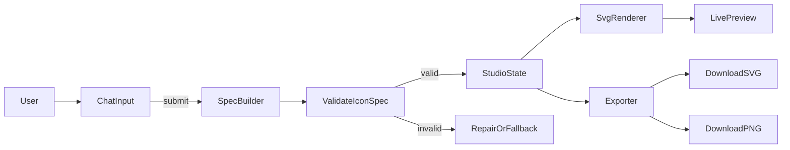

# Icon Studio v0 (client-first, instant preview)

### Product goal

Deliver **browser-fast visual feedback** for non-technical users by making **IconSpec JSON** the single source of truth and rendering/exporting deterministically client-side (no HTML/SVG “free-for-all”).

### v0 scope (based on your answers)

- **Primary output**: Icons (single + small sets)
- **Runtime constraint**: **Client-first** (renderer + exports in-browser; server only for LLM later, optional)

**Non-goals for v0**

- Consulting reports/emails/UI pages
- Arbitrary raw SVG/HTML injection
- Server-side export pipeline (headless Chrome)

### UX (simple, familiar, fast)

- **Left panel**: Chat input + prompt chips + preset gallery
- **Right panel**: Live preview with tabs
  - Preview (SVG)
  - Spec (JSON)
  - Code (exported SVG string)
  - Export (SVG + PNG sizes)
- **Version history**: every generation is a revision with Restore + Compare (spec diff)

### Core architecture (low-latency)

- **IconSpec JSON → validate → render**
  - Keep the **last valid spec** on screen while new specs are being generated/validated.
  - Render SVG via React elements (no `dangerouslySetInnerHTML`).
- **Exports**
  - SVG: serialize from spec deterministically.
  - PNG: render SVG into `<canvas>` (or `OffscreenCanvas` where available) for requested sizes.

### IconSpec v0.1 (keep it small, enforce style)

- **Doc type separation**: `docType: "icon"` only for v0.
- **Presets & tokens**: presets control stroke caps/joins, default stroke width, corner rounding, and palette.
- **Restricted element set**: start with `path` (and optionally `circle/rect/line` later) to keep renderer small.

Example shape (illustrative):

- `docType`, `name`, `preset`, `size`, `viewBox`, `strokeWidth`, `stroke`, `fill`, `paths: [{ d }]`, `exports: { svg: true, png: [64,128,256] }`

### Implementation plan (files & responsibilities)

- **App shell + layout**
  - Update [`app/page.tsx`](app/page.tsx) to mount a single client component (`IconStudio`).
  - Keep global styling in [`app/globals.css`](app/globals.css) and use Tailwind utility classes for layout.

- **UI components (small premium kit)**
  - Add:
    - [`app/components/IconStudio/IconStudio.tsx`](app/components/IconStudio/IconStudio.tsx): orchestrates state + layout (client component)
    - [`app/components/IconStudio/ChatPanel.tsx`](app/components/IconStudio/ChatPanel.tsx): prompt, chips, submit
    - [`app/components/IconStudio/PresetGallery.tsx`](app/components/IconStudio/PresetGallery.tsx): preset thumbnails + selection
    - [`app/components/IconStudio/PreviewPanel.tsx`](app/components/IconStudio/PreviewPanel.tsx): preview tabs (Preview/Spec/Code/Export)
    - [`app/components/IconStudio/HistoryPanel.tsx`](app/components/IconStudio/HistoryPanel.tsx): revisions, restore, compare

- **Spec + presets + renderer (deterministic core)**
  - Add:
    - [`app/lib/iconSpec/schema.ts`](app/lib/iconSpec/schema.ts): `IconSpec` runtime validation (recommend `zod`) + TypeScript types
    - [`app/lib/iconSpec/presets.ts`](app/lib/iconSpec/presets.ts): curated preset registry (outline_rounded, outline_sharp, solid, duotone)
    - [`app/lib/iconSpec/render.tsx`](app/lib/iconSpec/render.tsx): React renderer that maps `IconSpec → <svg>`

- **Exports (client-side)**
  - Add:
    - [`app/lib/iconSpec/serializeSvg.ts`](app/lib/iconSpec/serializeSvg.ts): spec → SVG string (deterministic)
    - [`app/lib/iconSpec/export.ts`](app/lib/iconSpec/export.ts): download helpers + SVG→PNG conversion
  - v0 exports:
    - Download SVG
    - Download PNG at fixed sizes (64/128/256)

- **Revision history + diff (trust builder)**
  - Add:
    - [`app/lib/studio/history.ts`](app/lib/studio/history.ts): revision model + localStorage persistence
    - [`app/lib/studio/diff.ts`](app/lib/studio/diff.ts): minimal JSON diff for “Compare” (textual diff is fine for v0)

### Phase breakdown (fast iteration)

- **Phase 0: Beautiful skeleton (no LLM required)**
  - Ship the full UI with 3–5 sample IconSpecs and working exports.
  - Goal: prove instant preview + export pipeline.

- **Phase 1: LLM IconSpec generation (optional next)**
  - Add a thin Next Route Handler: [`app/api/icon-spec/route.ts`](app/api/icon-spec/route.ts) to call your model.
  - Implement **validate → repair loop** (if invalid JSON/schema fails, auto-retry once with a repair prompt).
  - Keep UI latency low: show spinner but don’t blank the preview; only swap on valid spec.

- **Phase 2: Icon sets + batch export**
  - Add `docType: "iconSet"` or `icons: IconSpec[]` with shared preset/tokens.
  - Batch export as a ZIP (optional), and/or multi-download.

### Performance & polish tactics (what makes it feel instant)

- Render only SVG + small panels (no heavy markdown/rendering).
- Debounce chat submission; keep state updates small.
- Memoize SVG render (`React.memo`) and only recompute PNG on explicit export.
- If batch PNG export gets heavy, move conversion into a WebWorker (Phase 2).

### Safety

- Never render raw SVG strings into the DOM.
- Restrict output to known attributes (`d`, `stroke`, `strokeWidth`, etc.).
- Validate all specs before rendering/exporting.