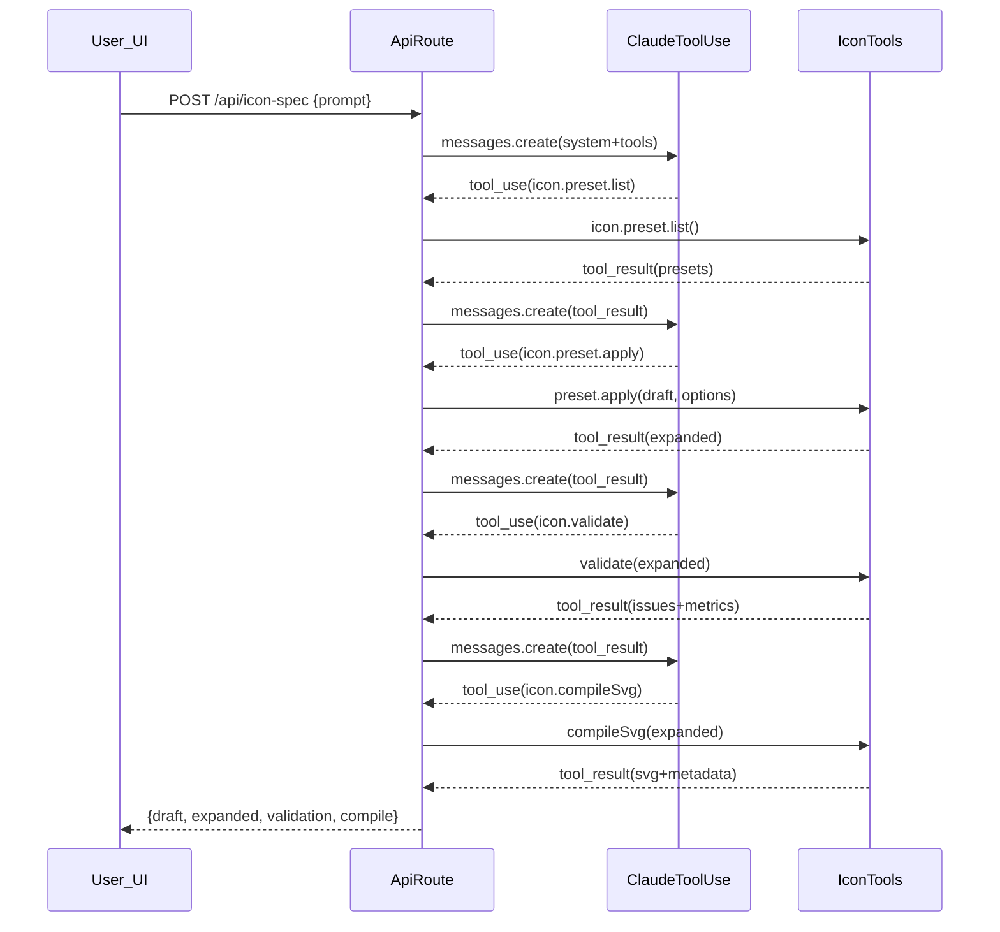

# Icon toolset contract (Draft→Apply→Validate→Compile)

### Goal

Align the repo with the contract you provided by introducing **IconDraft** (LLM authoring), **IconSpecExpanded** (preset-applied explicit style/constraints), a **preset registry**, a **preset-aware validator with issue codes**, and a **deterministic SVG compiler**—then expose them as **Anthropic tool-use tools** and update the IconStudio UI to consume the new outputs.

### Current gaps (what we’re changing)

- **LLM output format**: `/api/icon-spec` currently asks Claude for a single `IconSpec` that includes style fields and allows per-shape style (see [`app/api/icon-spec/route.ts`](app/api/icon-spec/route.ts) and [`app/lib/iconSpec/schema.ts`](app/lib/iconSpec/schema.ts)).
- **Preset model**: current presets are a small config (strokeWidth/fill/stroke/linecaps) without size-based stroke widths or constraints (see [`app/lib/iconSpec/presets.ts`](app/lib/iconSpec/presets.ts)).
- **Validation**: today it’s mostly Zod structure; there’s no preset-aware rules, grid/padding/bounds/complexity checks.
- **Compiler**: `serializeSvg` is close, but it emits style per-shape via defaults and uses a different element ordering than the new deterministic contract (see [`app/lib/iconSpec/serializeSvg.ts`](app/lib/iconSpec/serializeSvg.ts)).

### Target architecture

### Data model changes

- **Add `IconDraft` schema** (geometry-first, no per-shape styling):
  - Fields: `docType,name,preset,size,viewBox,paths,circles,rects,lines,polylines,exports`.
  - Enforce: geometry objects contain only geometry keys (e.g. `path: {d}`, `circle: {cx,cy,r}`, etc.).
- **Add `IconSpecExpanded` schema** (preset-applied explicit style + constraints):
  - Fields: `docType,name,preset,size,viewBox,style,constraints,geometry,exports`.
- **Keep exports shape** compatible with the UI (`exports.svg`, `exports.png`).

Primary file(s):

- Refactor [`app/lib/iconSpec/schema.ts`](app/lib/iconSpec/schema.ts) into:
  - `IconDraftSchema`
  - `IconSpecExpandedSchema`
  - shared shape schemas (paths/circles/rects/lines/polylines)
  - request/response schemas for the tool APIs

### Preset registry (migrate existing presets)

Replace the current `PresetConfig` with contract-style preset definitions:

- `outline_rounded` (as specified: `strokeWidthBySize`, `paddingBySize`, grid/complexity rules)
- `outline_sharp` (square caps + miter joins; same size maps/constraints defaults as `outline_rounded` unless you specify otherwise)
- `solid` (fill `currentColor`, stroke `none`, strokeWidth `0`; still enforces viewBox/exports/grid/complexity; padding may be smaller but still prevents clipping)
- `duotone` (migrated as a global-style preset for now; **no per-shape opacity** to keep the contract’s “no per-shape styling” invariant—if you want true 2-tone layering later we’ll extend the geometry model with a non-style `layer` field)

Primary file(s):

- Update [`app/lib/iconSpec/presets.ts`](app/lib/iconSpec/presets.ts) to export:
  - `iconPresetRegistry`
  - `iconPresetKeys`
  - helpers like `getPreset(id)` and `getStrokeWidthForSize(preset,size)`

### Implement the tool functions (pure TS, shared by server+client)

Create a new “tools/core” layer under `app/lib/iconSpec/` (so both the API route and the UI can reuse it):

- **`icon.preset.list`**: returns `{docType:"iconPresetList", presets:[{id,recommendedSizes}]}`.
- **`icon.preset.apply`**:
  - Inputs: `IconDraft` + options (`normalize`, `snapToGrid`, `fillMissingDefaults`).
  - Output: `IconSpecExpanded` + `changes[]`.
  - Behavior:
    - Fill defaults (size/viewBox/exports)
    - Apply size-based `strokeWidth`/`padding`
    - Normalize geometry arrays to always exist
    - Snap numeric geometry to integer grid
    - Snap/normalize path `d` numbers via a conservative numeric tokenizer (so it’s deterministic)
- **`icon.validate`**:
  - Schema + rule checks and produces `issues[]` with the exact codes you listed.
  - Metrics: `pathCount`, `totalPathCommands`, `estimatedStrokeBounds`.
  - Implement checks in layers:
    - Schema/required fields (`ICON_SCHEMA_*`)
    - Preset existence + style match (`ICON_PRESET_*`, `ICON_STYLE_*`)
    - viewBox agreement (`ICON_VIEWBOX_*`)
    - per-shape style ban (`ICON_STYLE_006`)
    - grid snapping (`ICON_GRID_*`) including path-number integer check
    - bounds/padding (`ICON_BOUNDS_*`) using estimated geometry bounds inflated by `strokeWidth/2`
    - complexity warnings (`ICON_COMPLEXITY_001`) via command-letter counting
    - export validation (`ICON_EXPORT_*`)
- **`icon.compileSvg`**:
  - Must re-run validation and **fail-fast** if any `severity:"error"`.
  - Deterministic output:
    - Root style attributes on `<svg>` (stroke/fill/stroke-width/linecap/linejoin)
    - Emit in order: `paths → rects → circles → lines → polylines`
    - Preserve ordering within each group
    - Return `svg` (pretty) + `svgMin` (minified) + metadata

Primary file(s):

- Add new modules (names flexible):
  - `app/lib/iconSpec/tools/presetList.ts`
  - `app/lib/iconSpec/tools/presetApply.ts`
  - `app/lib/iconSpec/tools/validate.ts`
  - `app/lib/iconSpec/tools/compileSvg.ts`
  - re-export from [`app/lib/iconSpec/index.ts`](app/lib/iconSpec/index.ts)

### Expose tools via Anthropic tool-use in the API route

Update [`app/api/icon-spec/route.ts`](app/api/icon-spec/route.ts) to:

- Define Anthropic `tools` matching:
  - `icon.preset.list`
  - `icon.preset.apply`
  - `icon.validate`
  - `icon.compileSvg`
- Replace the current “return IconSpec JSON” prompt with:
  - Your **Agent Workflow Rules** (verbatim)
  - Explicit schemas for IconDraft + tool I/O
  - Instruction to iterate when `icon.validate` returns errors
- Implement a tool-use loop:
  - Call Claude; when it returns `tool_use`, execute the matching handler and append a `tool_result` message; repeat
  - Stop when `icon.compileSvg` succeeds (or cap turns and return a useful error)
- Return to the client a structured payload, e.g.:
  - `{ draft, expanded, validation, compile }`
  - (Optionally also include `changes[]` from preset.apply)

### Update the IconStudio UI to use Draft/Expanded + compiled SVG

Refactor the UI to treat **IconDraft as the editable/source object** and **IconSpecExpanded as the renderable/compilable object**:

- [`app/components/IconStudio/IconStudio.tsx`](app/components/IconStudio/IconStudio.tsx)
  - Keep state: `currentDraft`, `currentExpanded`, `validation`, `compiledSvg`
  - On generation: call `/api/icon-spec` and store all returned artifacts
  - On preset change: update `draft.preset`, run `preset.apply → validate → compileSvg` locally for instant UI
- [`app/components/IconStudio/PreviewPanel.tsx`](app/components/IconStudio/PreviewPanel.tsx)
  - Spec tab: show both Draft + Expanded (toggle or stacked)
  - Code tab: show `compile.svg` (pretty) instead of calling `serializeSvg`
  - Export tab: export from compiled SVG string (still supporting color replacement for `currentColor`)
- [`app/components/IconStudio/PresetGallery.tsx`](app/components/IconStudio/PresetGallery.tsx)
  - Preview each preset by applying it to the current draft and rendering the expanded result
- Update sample icons to be drafts:
  - [`app/lib/iconSpec/samples.ts`](app/lib/iconSpec/samples.ts)

### Renderer/export updates

- Update [`app/lib/iconSpec/render.tsx`](app/lib/iconSpec/render.tsx) to render from `IconSpecExpanded`:
  - Root carries style (stroke/fill/strokeWidth/linecap/join)
  - Shape elements emit only geometry attributes
- Replace/repurpose [`app/lib/iconSpec/serializeSvg.ts`](app/lib/iconSpec/serializeSvg.ts) to call the new `compileSvg` implementation (or keep `serializeSvg` as a thin wrapper around `compileSvg` for backwards compatibility).
- Update [`app/lib/iconSpec/export.ts`](app/lib/iconSpec/export.ts) to export using compiled SVG strings (and a helper to replace `currentColor` with a chosen export color).

### Compatibility & migration notes

- Remove per-shape style fields from the schemas; ensure legacy sample data is migrated.
- If you have any saved specs elsewhere later, add a small `migrateLegacyIconSpecToDraft()` helper (optional).